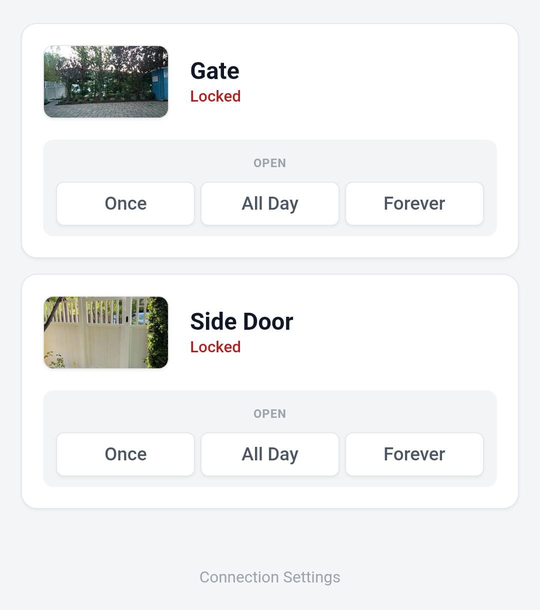

# UniFi Gate

Self-hosted web controller for UniFi Access door locks. Control your doors from any browser with Firebase authentication and optional Cloudflare tunnel for remote access.



## Features

- Web UI for controlling UniFi Access door locks
- Hold doors open with custom end times or indefinitely
- Schedule-based hold-open injection
- Real-time door status via WebSocket
- Firebase authentication with Google sign-in
- Cloudflare Worker edge authentication
- User management with admin/user roles and invite system
- Android app for mobile control
- Health monitoring with ntfy alerts
- Auto-recovery from expired controller sessions
- Terminal UI for local control

## Prerequisites

- Python 3.12+
- UniFi Access controller on your network
- Optional: Cloudflare account (for remote access via tunnel)
- Optional: Firebase project (for authentication)
- Optional: Android Studio (for mobile app)

## Quick Start

1. **Clone and set up:**
   ```bash
   git clone https://github.com/scottmsilver/unifi-gate.git
   cd unifi-gate
   python -m venv .venv
   source .venv/bin/activate
   pip install -r requirements.txt
   ```

2. **Configure:**
   ```bash
   cp .env.example .env
   # Edit .env with your UniFi controller details and optional Firebase/Cloudflare config
   ```

3. **Create credentials file:**
   ```json
   {
     "host": "YOUR_CONTROLLER_IP",
     "username": "admin",
     "password": "your_password"
   }
   ```
   Save as `credentials_native.json`.

4. **Run:**
   ```bash
   python server.py
   ```
   Visit `http://localhost:8000`. Use `--dev` flag to disable authentication for local testing.

## Architecture

- **`server.py`** -- Flask web server, handles all HTTP endpoints
- **`unifi_native_api.py`** -- Reverse-engineered UniFi Access API (schedules, hold-open)
- **`unifi_access_api.py`** -- Official UniFi Developer API (door listing, unlock)
- **`unifi_websocket.py`** -- Real-time WebSocket event handler
- **`schedule_manager.py`** -- Hold-open schedule injection
- **`worker/`** -- Cloudflare Worker for edge authentication
- **`android-app/`** -- Android client app

## Cloudflare Worker Setup

See `worker/README.md` for setting up the edge authentication worker.

## Deployment

For production deployment to an Incus/LXC container:
```bash
./scripts/deploy.sh [container-name]
```

## Health Monitoring

Set up ntfy-based alerting with `scripts/health-check.sh`. See the script comments for cron setup.

## Contributing

Contributions welcome. Please open an issue first to discuss what you'd like to change.

## License

[MIT](LICENSE)
