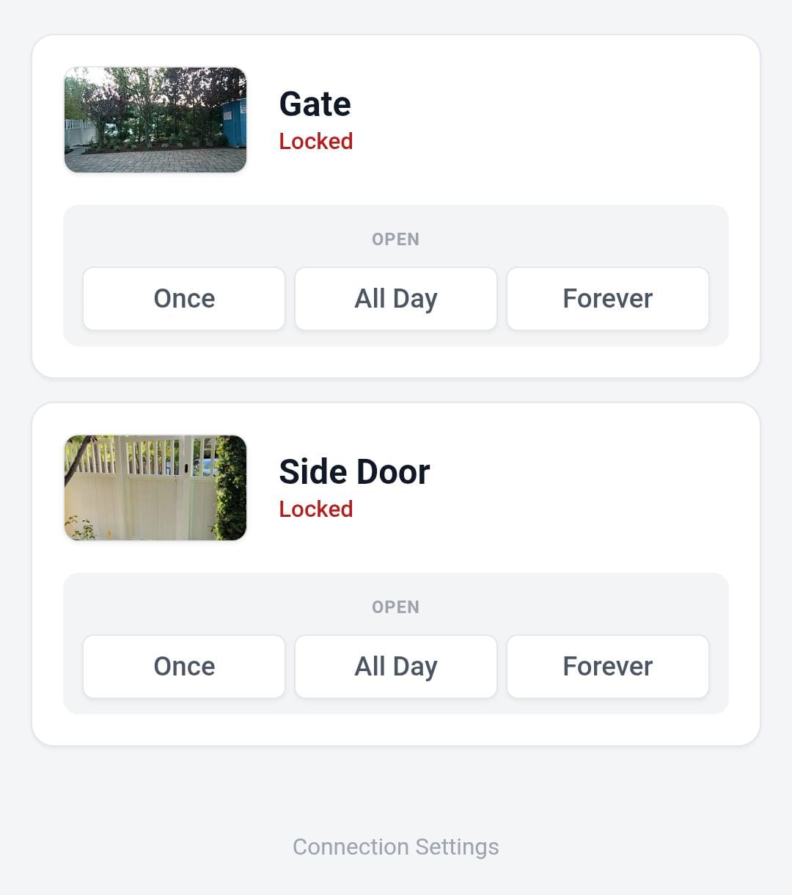

# UniFi Gate

Self-hosted web controller for UniFi Access door locks. Control your doors from any browser, with Firebase authentication and an optional Cloudflare tunnel for remote access.



## Features

- Web UI to unlock doors and hold them open (timed or indefinite)
- Built on the official UniFi Access Developer API (bearer token, port 12445) — no cookies, no 2FA juggling
- Optional UniFi Protect snapshots for the door card
- Real-time door events via the Developer API WebSocket
- Firebase / Google sign-in with a Cloudflare Worker validating JWTs at the edge
- Admin / user roles plus an email invite flow
- mDNS advertisement so the LAN can auto-discover the gate
- Android and iOS clients (separate trees)

## Prerequisites

- Python 3.12+
- UniFi Access controller reachable on your network
- A Developer API token (Settings → System → Advanced → API Token in the UniFi UI)
- Optional: Cloudflare account for the auth-validating Worker + tunnel
- Optional: Firebase project for sign-in

## Quick Start

```bash
git clone https://github.com/scottmsilver/unifi-gate.git
cd unifi-gate
python -m venv .venv
source .venv/bin/activate
pip install -r requirements.txt
python server.py --dev          # auth disabled — local testing only
```

Open `http://localhost:8000` and use the in-app Settings → Connection form to enter your controller host and Developer API token. The token is written to `credentials.json`; nothing is hard-coded.

For real use, drop `--dev` and put the Cloudflare Worker (`worker/`) in front so Firebase JWTs are validated before requests reach the server.

## Architecture

| File | Purpose |
| --- | --- |
| `server.py` | Flask app: routes, auth gating, mDNS, WebSocket event handling |
| `unifi_access.py` | Developer API client — doors, devices, lock_rule (hold), thumbnails, WS events |
| `unifi_protect.py` | Protect Integration API — camera list + snapshots |
| `schedule_manager.py` | Thin wrapper over `lock_rule`. The controller owns the hold timer; we just translate HH:MM end-times and shape responses |
| `user_store.py` | SQLite/JSON user storage with role + status |
| `invite_manager.py` | Email-based invite flow |
| `event_log.py` | Append-only audit log |
| `kv_sync.py` | Push approved users to Cloudflare KV |
| `worker/` | Cloudflare Worker that validates Firebase JWTs at the edge |
| `android-app/`, `ios/` | Mobile clients |

The controller is the source of truth for hold state. The server does not mirror it locally — every `/devices` request reads `lock_rule` directly so the UI always agrees with the hardware.

## Deployment

Push to an Incus/LXC container:

```bash
./scripts/deploy.sh [container-name]
```

The script syncs code, installs deps, writes a systemd unit, and restarts the service. State files (`credentials.json`, `users.json`, `.env`) are seeded once and never overwritten on subsequent deploys.

## Cloudflare Worker

See `worker/README.md` for setting up the edge auth Worker (Firebase JWT verification + KV-backed allowlist).

## Health Monitoring

`scripts/health-check.sh` posts to ntfy if `/health` is non-200. See the script header for cron setup.

## Contributing

Open an issue first to discuss substantial changes.

## License

[MIT](LICENSE)
